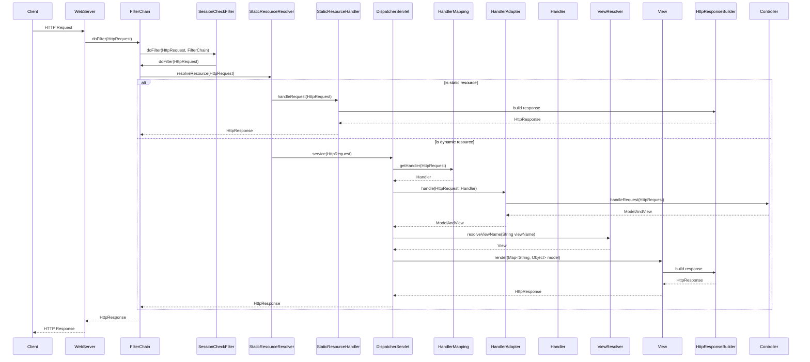

# Java WAS

2024 우아한 테크캠프 프로젝트 WAS

## 빌드
./gradlew clean build

## 흐름도

```mermaid
sequenceDiagram
    participant Client
    participant WebServer
    participant FilterChain
    participant SessionCheckFilter
    participant StaticResourceResolver
    participant StaticResourceHandler
    participant DispatcherServlet
    participant HandlerMapping
    participant HandlerAdapter
    participant Handler
    participant ViewResolver
    participant View
    participant HttpResponseBuilder
    Client->>WebServer: HTTP Request
    WebServer->>FilterChain: doFilter(HttpRequest)
    FilterChain->>SessionCheckFilter: doFilter(HttpRequest, FilterChain)
    SessionCheckFilter->>FilterChain: doFilter(HttpRequest)
    FilterChain->>StaticResourceResolver: resolveResource(HttpRequest)
    alt is static resource
        StaticResourceResolver->>StaticResourceHandler: handleRequest(HttpRequest)
        StaticResourceHandler->>HttpResponseBuilder: build response
        HttpResponseBuilder-->>StaticResourceHandler: HttpResponse
        StaticResourceHandler-->>FilterChain: HttpResponse
    else is dynamic resource
        StaticResourceResolver->>DispatcherServlet: service(HttpRequest)
        DispatcherServlet->>HandlerMapping: getHandler(HttpRequest)
        HandlerMapping-->>DispatcherServlet: Handler
        DispatcherServlet->>HandlerAdapter: handle(HttpRequest, Handler)
        HandlerAdapter->>Controller: handleRequest(HttpRequest)
        Controller-->>HandlerAdapter: ModelAndView
        HandlerAdapter-->>DispatcherServlet: ModelAndView
        DispatcherServlet->>ViewResolver: resolveViewName(String viewName)
        ViewResolver-->>DispatcherServlet: View
        DispatcherServlet->>View: render(Map<String, Object> model)
        View->>HttpResponseBuilder: build response
        HttpResponseBuilder-->>View: HttpResponse
        View-->>DispatcherServlet: HttpResponse
        DispatcherServlet-->>FilterChain: HttpResponse
    end
    FilterChain-->>WebServer: HttpResponse
    WebServer-->>Client: HTTP Response
```